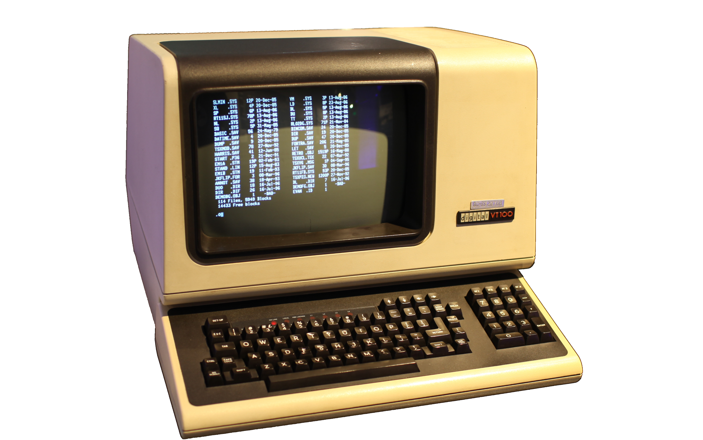

## Hello world!
- Arianna Masciolini
- background in Computer Science
- PhD student in Language Technology at Språkbanken Text (University of Gothenburg, Sweden)
- main interests: Computational Syntax and SLA
- met Ludovica at the UniDive training school in Chișinău last summer

## Today's session
1. What is the terminal and why do we care? <!--oral intro-->
2. Basic bash commands and how to combine them <!--live demo-->
3. Text processing example <!--live demo & exercises-->

## What you will need
A UNIX-like shell (preferably __bash__) or, if you don't have one installed on your laptop, \color{SecondaryColor}[an online one](https://bellard.org/jslinux/vm.html?url=alpine-x86.cfg&mem=192)\color{black}:

## What is a terminal?

## What is a terminal?
Today, a terminal _emulator_ is:

- an application that runs on your computer like any other application
- depending on what operating system you are using, it might be called: _terminal_, _command line/prompt_ or _shell_[^1]
- a textual interface to your own machine

[^1]: but technically, shell $\neq$ terminal

## Why do we still use a terminal?
- many useful programs only have a textual interface
- certain operations are more efficient (or just easier!) if performed through the command line
- it is the best way to run your own programs
- you will often interact with servers via the command line

## What about bash?
- bash is a very popular *command-line shell* and *scripting language*
- it was an important part of \color{SecondaryColor}[the UNIX operating system](https://www.youtube.com/watch?v=tc4ROCJYbm0) \color{black}
- today, it is preinstalled on most Linux ($\to$ basically every server in the galaxy) and MacOS systems, but not on Windows (hence WSL)

## Exercises
Modify the text processing command so to:

- show the _20_ most frequent words
- show the 20 _least_ frequent words
- show all words and their counts _in alphabetical order_
- write the results to a new text file
- show the 10 most frequent words, _excluding punctuation_
- show all words _whose frequency is exactly 1_
- ...

## Next time
Version control with git, so:

- ensure you have bash (or very similar) installated
- save your scripts from today!