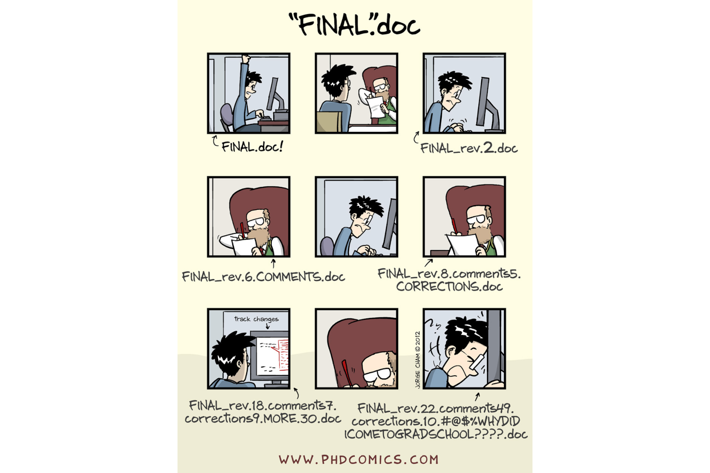
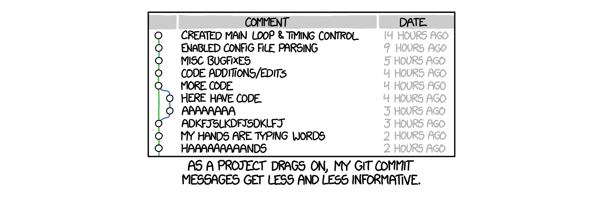

## Today's session
1. intro to version control and Git (again)
2. hands-on Git(Hub) tutorial

## What you will need
- a Unix-like shell 
- the basic Git CLI program
- a GitHub account
- (if you use VSCode, I can recommend an extension called Git Graph)

## Manual versioning
\bigskip

## Version Control Systems
1. need to save disk space: __patch-based VCS__ (e.g. RCS)
3. need for collaborative development: __centralized VCSs__ (e.g. SVN)
4. need to work offline and prevent the server from being the "single point of failure": __distributed VCSs__ (e.g. Git, the current _de facto_ standard)

## Behind Git
\bigskip

\vskip -5pt \footnotesize \centering Linus Torvalds, the creator of both Linux and Git

\vskip -7pt \tiny \centering recommended: [\underline{youtube.com/watch?v=4XpnKHJAok8}](youtube.com/watch?v=4XpnKHJAok8)

## Git: basic concepts

\vskip -10pt \tiny \centering image from [\underline{xkcd.com}](xkcd.com)

- (named) filesystem snapshots rather than patches
- version history as a directed graph
- distributed, supports easy branching
- several interfaces and "hubs"

## Hands-on Git tutorial
1. __local usage__ (simple versioning)
2. __setting up a remote GitHub repository__ \newline (versioning + backup)
3. collaborative usage with GitHub