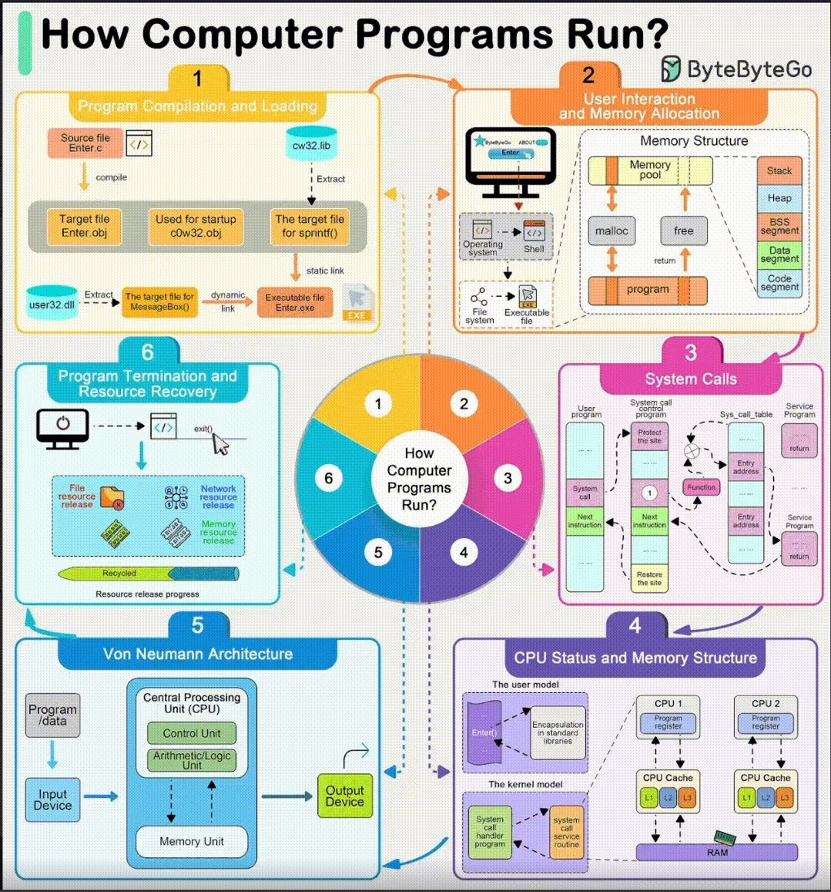
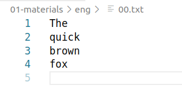
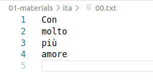

# Setting up the environment

Research in the humanities involves data, which is day by day increasing in size and complexity.
Along with the increase of data, also our needs as researchers increase. And the amount of knowledge that is taken for granted and implied each time we talk about how we process data.

Typically research questions require tools that do not - yet - exist. Or maybe there's a tool that does something quite like what we want, except we'd like it to use a different input or change that tiny step there. The tools should adapt to our research, not the other way round. Knowing how things work means being able to request specific modification, or modify tools ourselves. And, most importantly, it gives us access to a much wider array of tools.

Then comes the issue of durability and reproducibility. We need to be able to justify our process, to make it work again and in a different environment, and to use process released by other researchers, and build on top of it.

Lastly, there's teamwork. In order for it to be smooth and efficient, we need to understand each others' settings, agree on formats and interfaces and provide colleagues with data they can actually work with.

## So, how do computer programs run?

1. In order to run something, we usually double click on the software icon and something happens. This runs some code which has been compiled specifically for our machine, and some of it refers to other code (libraries etc) that is stored somewhere on our computer (i.e., not every software contains everything that it needs in itself).

2. Through the software GUI we execute commands. This means that some interaction with the operating system is happening. Data is loaded from the file system, commands are parsed into CPU-understandable instructions and we get our result. This means that memory has to be organized in a way that both the code and the information needed for computing our result is there, and there must be space for intermediate steps.

3. ??

4. Our command is really executed by the CPU, that anyway can only understand very very basic commands like ADD Value1 and Value2, FETCH FROM RAM, PUSH TO RAM. The CPU must have some internal memory to be able to operate and know what is the next command. But the CPU is at the same time also responsible for keeping all the rest of our computer running: if we double click on another software (i.e., we want to open the browser), the CPU has to take care of that, keep the clock showing the right time, show us the level of wi-fi connection etc.

5. All of this is usually abstracted into what is called "Von Neumann Architecture".
   * It's all made up of 4 parts:
     	- MEMORY: where we store both data and instructions necessary to solve our task (both of them, this is crucially why our computers are 'programmable' and not just clever machines that can solve just one problem)
     	- CPU: the nucleus of everything, split in two parts - control unit and arithmetic unic. The first one decides what to do next and switches between modes, the second one does the work.
     	- INPUT/OUTPUT devices: how and where we provide data to memory and how we store the final result
     	- BUS: data and code has to move to and from input - memory - cpu output.
   * When we click on a command in a GUI, our input goes to the CPU, that loads the instructions on how to perform that complex task. The control unit instructs the arithmetic unit to do things in the right order and pushes data to memory again. At the end, the final value gets to the output device (for instance, the GUI again, so that we see it on screen).

6. Eventually, when the program has completed its task, or the user actively terminates the application, the program will begin a cleanup phase. This includes closing open file descriptors, freeing up network resources, and returning memory to the system.

## Do we care?

Unlike industry, research is not about finding the solution, packaging it and shipping it around the world with a nice interface.
It's about connecting the dots, sharing processes and knowing why what happens, happens.
Plus, most of the times we don't get an efficient ticketing system that solves our issues with the softwares we're using, so when something unexpected with data comes up, we need to be able to dig deep and find out why.
Knowing how the layering works helps us understand what our software actually does, and how to develop or ask to develop better or on-purpose software.

### A small problem: counting characters

If it seems too complex, let's take a look at a very very basic example:
We all work with text and text is made of words which is in turn made of characters. And we're all familiar with characters, right?
So let's count characters.

1. Let's start easy, an english list of words (`eng/00.txt`):

	
   * how many characters?
   * how big is the file?
   * Also, we're lazy, and we want to double check our counts.
  	So we found a couple of online tools that count characters for us.
     	- [Editpad Character counter](https://www.editpad.org/tool/character-counter)
  		- [Character count online](https://www.charactercountonline.com/)
     	- [Character counter](https://charactercounter.com/)

2. What if we create the same file on windows?

   * how many chatacters?
   * how many bytes?

3. Now let's try and switch to Italian:
	

	* how many characters?
	* how many bytes?

4. And again, what about windows?

5. Last thing. We've created a bigger file (`verylongfile.txt`). This is made up by the content of our small file, but repeated 5M times.
   * how many characters?
   * how many bytes?
   * So how much memory should it take to read it with a standard editor?

### OK but why UNIX?

Mainly, because of compatibility.
Computers are pretty much the same stupid machines with all OS running on them. But UNIX is a very big family of operating systems and it happens to run on most servers (because it's lightweight, stable, open source...).

This means that if you know how to use your very fancy Linux distribution that runs on your laptop, you'll also be more or less able to find your way on the scary University server.

Moreover, the level of control we get about all the layers is much higher.
On the down side: it takes some time to master the basics.

