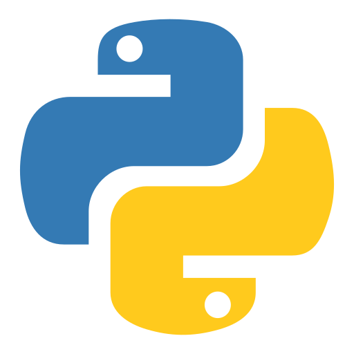

What is a programming language?
==============================

<!-- incremental_lists: true -->

- A programming language is a formal language that specifies a set of instructions that can interpreted by a computer
- Each programming language has its own syntax and semantics
- A programming language can be used to write programs 

<!-- end_slide -->

What is Python?
===============

<!-- incremental_lists: true -->

- Python is a high-level, general-purpose programming language
- It was created by _Guido van Rossum_ and first released in 1991
- Since 2020, we use `python3` which is not compatible with previous releases
- It is widely used in academia, industry, and research
- It is known for its readability and simplicity
- It is open-source and has a large community of users and developers

<!-- end_slide -->

Why Python?
==============

<!-- incremental_lists: true -->

- Python is a versatile language that can be used for many different tasks
- It is easy to learn and use
- It has a large standard library and many third-party packages
- It is cross-platform and runs on all major operating systems
- It is widely used in scientific computing, data analysis, machine learning, web development, and more:
  - https://github.com/meta-llama/llama
  - https://github.com/home-assistant/core

<!-- end_slide -->

How to use Python
=================

- Python can be run interactively in a REPL (Read-Eval-Print Loop) or in scripts
- The Python interpreter can be started by typing `python` in the terminal
- Python scripts are text files with the `.py` extension that contain Python code
- Python code can be executed by running the script with the Python interpreter (`python script.py`) or by making the script executable and running it directly (`./script.py`)

<!-- end_slide -->

Basic Python syntax
===================

<!-- incremental_lists: true -->

### data types:
   - number: `42`, `3.14`
   - strings: `"Hello, world!"`
   - booleans: `True`, `False`
   - collections: `[1, 2, 3]`, `{"foo": 4, "bar": 7}`

### statements:
   - print on terminal: `print("hello")`
   - variable assignment: `x = 42`
   - conditional: `if x == 42:`
   - loop: `for i in range(10):`

### expressions:
   - arithmetic: `x + 1`
   - comparison: `x == 42`
   - logical: `x > 0 and x < 100`

reference: [How to Think Like a Computer Scientist](https://runestone.academy/ns/books/published/thinkcspy/index.html) chapter 2

<!-- end_slide -->

Text processing in Python
=========================

<!-- incremental_lists: true -->

### string manipulation
  - `.split()`, split on spaces
  - `.strip()`, remove leading and trailing spaces
  - format string: `f"hello {name}"`

### open and reads files
  - `open("path.txt", "r", encoding="utf-8")`, open a file
  - `.readlines()` read line by line  
  - `.read()` read the whole file
  - `.write()` write a string to file

<!-- end_slide -->

Exercises
=========

<!-- incremental_lists: true -->

1. write a Python script that reads a text file and counts the number of words in it
1. write a Python script that reads a text file and prints word with its count
1. write a Python script that reads a text file and prints the 10 most common words in it
1. write a Python script that reads a text file and plots the frequency of the words
