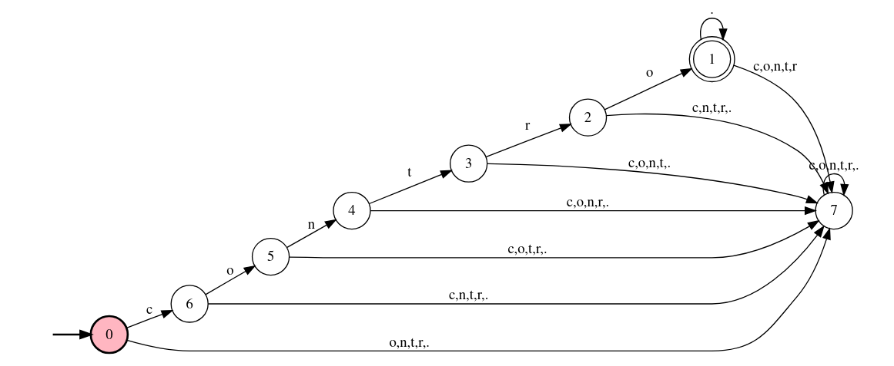

<!-- _class: lead -->

# Advanced Regular Expressions

<br>

**Ludovica Pannitto**
`ludovica.pannitto@unibo.it`
`lilec.lab@unibo.it`
18-19/11/2024

---

<!-- _header: A definition -->

(From Wikipedia)

    A regular expression (shortened as regex or regexp) is a sequence
    of characters that specifies a match pattern in text.

In other words, as you know, we use regular expressions to describe a **class** of strings rather than a single one.

```
contro.* -> {contro, controllo, controlli, controllore, controllori,
            controversia, controparte, controrivoluzione, contromarche...}
```

---

<!-- _header: Formal Languages -->

Ok, but **any** class of strings?

    Regular expressions describe regular languages in formal language theory.
    They have the same expressive power as regular grammars.

In formal language theory, any set of strings can be a **language**.

```
L1 = {fragola, banana, kiwi}
L2 = {a, b, c, ab, ac, bc, abc}
L3 = {a, aa, aaa, ..., b, bb, bbb, ...}
```

---

The **alphabet** $\Lambda$ of a formal language consists of symbols, letters, or tokens that concatenate into strings called **words**.


$\Lambda$ = {a, b} $\to$
```
L1 = {a, aa, aaa, ..., b, bb, bbb,...}
L2 = {aa, aaaa, aaaaaa, ..., bb, bbbb, bbbbbb,...}
L3 = {ab, aabb, aaabbb, ...}
```

Different languages have different properties and require more or less expressive power in order to be described.

---

<!-- _header: Regular Expressions, Formal Grammars and Automata -->


Each time we write a regular expression we are, equivalently:
1. defining a **finite state automaton** that is able to recognize a string as part of the language



---

2. defining a **regular grammar** that is able to generate all the strings we're interested in

```
  S -> "contro" A
  A -> e
  A -> "a" A | "b" A | "c" A | "d" A | "e" A | ...
 ```

All strings expressed by the regular expression `contro.*` can be generated by this grammar:

```
S -> "contro" A -> "contro" "p" A -> "contro" "p" "r" A
-> "contro" "p" "r" "o" A -> "contro" "p" "r" "o" "v" A
-> "contro" "p" "r" "o" "v" "a" A ->  "contro" "p" "r" "o" "v" "a" e
-> "controprova"
```

---

<!-- _header: Regular Expression as a declarative language -->

So, having written our _regex_, we then need a way to actually use to to retrieve strings.
In this sense, regular expressions are also a **declarative language**. We never define how we want the match to occurr (i.e., the algorithm to actually implement the automaton), we're just describing what kind of match we want.
We will then need an **interpreter** that transforms our regular expression into an actual matching device.

    A regex processor translates a regular expression in the above syntax
    into an internal representation that can be executed and matched against
    a string representing the text being searched in.

---

<!-- _header: Regular languages -->


Not all languages are regular (`L3` on slide 4 is not)! ($\to$ we might not be able to write a regular expression to identify the set of strings we want to retrieve!)


Luckily...

    Many features found in virtually all modern regular expression libraries
    provide an expressive power that exceeds the regular languages.

---

<!-- _header: Advanced matching -->

You already saw **QUANTIFIERS**:

* `*` $\to$ 0 to multiple matches
* `+` $\to$ 1 to multiple matches (`.+ is the same as ..*`)
* `{x, y}` $\to$ x to y matches (we can also have `{x}` for exactly `x`, `{, y}` for at most `y` or `{x,}` for at least `x`)
* `?` is a shortcut for `{0,1}`

Also:

* (alternation) `|` $\to$ union of two matches, (i.e., `or`)

---

Now let's abstract away from sketchengine and use regular expressions just as matching tools on plain text.

NB: Let's keep in mind that we can also use them to **replace** matches (e.g., transform all `ludovica` into `Ludovica` or transform all `contro.*` into `contro-X` instances)

Just a reminder:

The **alphabet** $\Lambda$ of a formal language consists of symbols, letters, or tokens that concatenate into strings called **words**.

---

<!-- _header: Back to tokens -->

We know that every character in our text is a _token_

* can you match an alphabetical letter (e.g., letter `f`) or a sequence of letters?
* can you match a digit (e.g., number `0`) or a sequence of digits?
* can you match punctuation?  in order to match a point, we need to escape it! $\to$ `\.`
* can you match a white space? $\to$ ` `
* can you match a tabulation? $\to$ `\t`
* can you match a newline? $\to$ `\n`

---

Usually, also _meta sequences_ or _character classes_ are defined to make regular expressions more readable:

* you already know about `.`
* any whitespace $\to$ `\s` or `[[:space:]]`
* any digit $\to$ `\d` or `[[:digit:]]`
* any alphabetical character $\to$ `\w` (includes numbers) or `[[:alpha:]]` (only letters)
* any punctuation mark $\to$ `[[:punct:]]`
* ...

---

<!-- _header: Anchors -->

We're still missing some tools! What if we want to match something:

* at the beginning of the line $\to$ `^`
* at the end of the line $\to$ `$`
* at the beginning or end of a word $\to$ `\b`

---

<!-- _header: Exercises -->

1. Match:
   1. A word of at least two alphabetical tokens followed by colon
   2. A word of at most eight alphabetical tokens followed by colon, possibly separated by whitespace
   3. Words starting with capital `P` at the beginning of the line
   4. Lines containing at most 3 words and ending with a question mark
   5. The name of a pdf file with its extension (hint: what caracters can be part of a filename? Ignore whitespaces)
   6. IP addresses: (for example, `192.178.0.21`. If you want to overcomplicate things, IP addresses can have values between `0.0.0.0` and `255.255.255.255`)
   7. A number (integer or float)
   8. Dates (espressed as DD/MM/YYYY or DD month YYYY)
   9. Only valid roman numbers between 1 and 10 (try to make is as compact as possible!)
   10. A word containing two or more contiguous `n`s (e.g., `anno`, `cannone`...)
   11. A word containing at least two `n`s, not necessarily contiguous (e.g., `nano`, `panettone`...)

2. Replace:
   1. Integers with the string `@NUM_INT` and floats with the string `@NUM_DEC`
   2. Remove spaces at the beginning or end of line

---

<!-- _header: Range of tokens -->

We can also define a specific group of accepted characters $\to$ `[]`

For instance, there's no pre-defined meta sequence for vowels but we can define:

- `[aeiou]` for `a OR e OR i OR u OR u`

Square brackets can also be used for ranges:

- `[0-9]` is the same as saying `\d`
- `[a-z]` means all alphabetical letters from `a` to `z` (lowercased, pay attention to encoding!)

---

<!-- _header: Exercises -->

1. Match:
   1. `care`, `mare`, `fare`, `rare`, `pare`, `gare`
   2. all verbs in infinitive form in italian
   3. A word starting with a vowel
   4. A line starting with a vowel (issue: lowercase or uppercase?)
   5. A word containing two or more contiguous vowels
   6. A word containing at least two vowels, not necessarily contiguous
   7. Capitalized words
   8. Words in uppercase
   9.  Even numbers

2.  Replace
    1.  Every vowel with `V` and every consonant with `C`
    2.  Sequences of punctuation characters with `_PUNCT_`

---

<!-- _header: Negative matching: NOT -->

We can also define a characters in terms of what we **don't** want to match.
This is expressed by `^` enclosed in square brackets.

For example:
    - `[^abc]` matches every possible character that is not either `a`, `b` or `c`
    - `[^aeiou]` matches every possible character that is not a vowel
    - `[^0-9]` matches every possible character that is not a digit
    - `[^\s\d]` matches every possible character that is not a space or a digit

For character classes, usually the upper-cased version of `\x` means `not \x`

Fun fact: within square brackets, characters such as `.`, `*` etc do not need to be escaped

---
<!-- _header: Exercises -->

1. Match:
   1. Words not starting with a digit
   2. Words enclosed by parentheses: `(lorem ipsum dolor)`
   3. All forms but infinitive of the verb `amare` (*)
2. Replace:
   1. Every vowel with `V` and every consonant with `C`, everything else with `-` without repetitions

---

<!-- _header: Groups and Backreferences -->

We might want to search for something that has the same structure repeated multiple times.

For example, an IP address is made up by three groups of at most 3 numbers followed by a dot, followed by one last group of numbers.

    (N N N .) (N N N .) (N N N .) N N N

In order to place parts of the expression inside a group we can use parentheses.

    ( \d{1,3} \.){3} \d{1,3}

---

Once defined, a group can also be referenced later in the regular expression.

For example we might want to look for words starting and ending with the same letter $\to$ `arpa, oggetto, pulp, snakes`

    (a letter) (the rest of the string) (the initial letter)

    (a) (rp) (a)

Groups get numbered from 1 to n, so that their match instance can be later used

    (\w) \w+ \1

---

<!-- _header: Exercises -->

1. Match:
   1. Lists of words separated by comma $\to$ `apple, kiwi, pear, orange, ...`
   2. Proper names (i.e., sequences of capitalized words)
   3. Words containing a double consonant
   4. Palindrome words of at most 6 characters
   5. acronyms
   6. All of Francesca's beloved reduplications
2. Replace:
   1. All univerbated forms of words prefixed with `pre` or `post` with their hyphened counterpart
        `preruolo` $\to$ `pre-ruolo`
        `premaman` $\to$ `pre-maman`
        `postapocalittico` $\to$ `post-apocalittico`


---

<!-- _header: Greediness -->

Let's go back at the parentheses example.

`(lorem ipsum dolor)`

One possible solution is to write the regex `\(.+\)`

But what happened if our string was the following?
`(lorem ipsum dolor) sit amet, (consectetur adipiscing elit),`

So, how to express **laziness**? $\to$ `?`

---

<!-- _header: Exercises -->

1. Match:
   1. html tags
2. Replace:
   1. Move everything that is enclosed by curly brackets into square brackets
   2. Transform all present forms of a `-are` verb with its infinitive
   3. Turn all numbers followed by `0` into the letter `A`
   4. Add a space between words and punctuation marks
   5. Transform a document where all proper names are expressed as `Name Surname`, into a document where all proper names are expressed as `Surname Name`
        ` Il sottoscritto Mario Rossi` $\to$ `Il sottoscritto Rossi Mario`
        * What if we also had middle names?

---

<!-- _header: More strange stuff (still worth knowing about it) -->

1. inline flags/modifiers
   - we saw that unicode encoding and case sensitivity can be managed with flags given to the interpreter.
   - they can also be placed inside the regex in parentheses $\to$ `(?i)a, (?-i)a, (?u)\w, (?-u)\w`
2. lookahead
   - there's usually a way to condition the match on what comes before/after
   - In sketchengine $\to$ `(?!th)\d\w\w`
3. some interpreters allow for conditional matching
   - `(A candy)?(?(1) is true| is false)`

